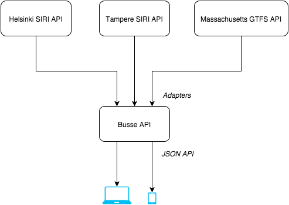

# Documentation

Documentation for developers.

## Overview

Busse API is a simple proxy API which gathers real time data from external APIs.
See the following diagram:

The external APIs have a bit different data format.
Adapters transform the data from external APIs to common "Busse" format.

### Add new area / add a new adapter

Adding a new area is simple:

1. Get GTFS static data dump of the area.
2. In the project root, run `node ./tools/parse-gtfs.js path/to/gtfs/routes > ./data/area.json`.
3. Write an adapter to [src/adapters/](../src/adapters/).

    Adapter module must export:

    * `id` Id of the area. Format `[a-z]+` e.g. 'tampere'.
    * `name` Human name of the area displayed in UI. E.g. `Tampere`
    * `latitude` Center of the area.
    * `longitude` Center of the area
    * `fetch` Function which returns a Promise. The promise must be resolved with array of vehicles locations in "Busse" format.

4. Enable the adapter by adding it to (src/adapters/index.js)(../src/adapters/index.js)

Now you should be able to get data for the area from Busse API.

## Areas

All areas in Busse and additional information about them.

Resources for finding new areas:

* https://code.google.com/p/googletransitdatafeed/wiki/PublicFeedsNonGTFS
* https://en.wikipedia.org/wiki/Service_Interface_for_Real_Time_Information

### Tampere

Data: `SIRI VM`

**Shortcuts:**

* [Tampere public transport developer site](http://developer.publictransport.tampere.fi/pages/en/home.php)
* [GTFS data dump](http://wiki.itsfactory.fi/index.php/Tampere_Public_Transport_GTFS_feed)
* [SIRI JSON API doc](http://wiki.itsfactory.fi/index.php/Tampere_Public_Transport_SIRI_Interface_(Realtime_JSON_at_data.itsfactory.fi))
* [SIRI JSON API doc](http://developer.publictransport.tampere.fi/pages/en/siri.php)
* [Register](http://developer.publictransport.tampere.fi/pages/en/account-request.php)

### Helsinki

Data: `SIRI VM`

**Shortcuts:**

* [Helsinki public transport developer site](http://dev.hsl.fi/)
* [GTFS data dump](http://developer.reittiopas.fi/pages/en/other-apis.php)
* [Register](http://developer.reittiopas.fi/pages/en/account-request.php)

**Comment:**

Helsinki uses special type of codes for their vehicle ids in SIRI VM data.
These ids are called "JORE codes". They provide an example how to convert that
special code to vehicle type and its id. See: https://github.com/HSLdevcom/navigator-proto/blob/master/src/routing.coffee#L40.

### Oulu (not implemented yet)

Data: `SIRI VM`

**Shortcuts:**

* [Oulu public transport developer site](http://www.ouka.fi/oulu/oulu-tietoa/avoin-data/-/asset_publisher/Wz43/content/id/4740330)
* [GTFS data dump](http://developer.matka.fi/pages/en/home.php)
* [SIRI API doc](http://www.ouka.fi/oulu/oulu-tietoa/avoin-data/-/asset_publisher/Wz43/content/joukkoliikenteen-reaaliaikatiedot?redirect=http%3A%2F%2Fwww.ouka.fi%2Foulu%2Foulu-tietoa%2Favoin-data%3Fp_p_id%3D101_INSTANCE_Wz43%26p_p_lifecycle%3D0%26p_p_state%3Dnormal%26p_p_mode%3Dview%26p_p_col_id%3Dcolumn-2%26p_p_col_pos%3D1%26p_p_col_count%3D2)
* [Register(not sure if only Oulu specific)](http://developer.matka.fi/pages/en/account-request.php)

**Comment:**

SIRI VM is in beta. The access to API can be requested via email.
**Note:** Their API limits access based in IP addresses. This means that you need static IP to access their API. :(

### Massachusetts (not implemented yet)

Data: `GTFS Realtime`

**Shortcuts:**

* [Massachusetts public transport realtime developer site](http://realtime.mbta.com/Portal/Home/Documents)
* [GTFS data dump](http://www.gtfs-data-exchange.com/agency/massachusetts-bay-transportation-authority/)
* [GTFS realtime documentation](http://realtime.mbta.com/Portal/Content/Documents/MBTA-realtime_GTFSRTDocumentation_v2_2014-08-04.pdf)
* [Register](http://realtime.mbta.com/Portal/Account/Register)

### Utah (not implemented yet)

Data: `SIRI VM`

**Shortcuts:**

* [GTFS data dump](http://www.gtfs-data-exchange.com/agency/utah-transit-authority/)
* [SIRI API doc](http://developer.rideuta.com/DeveloperResources/DataInstructions.aspx)
* [Register](http://developer.rideuta.com/DeveloperResources/Registration.aspx)
